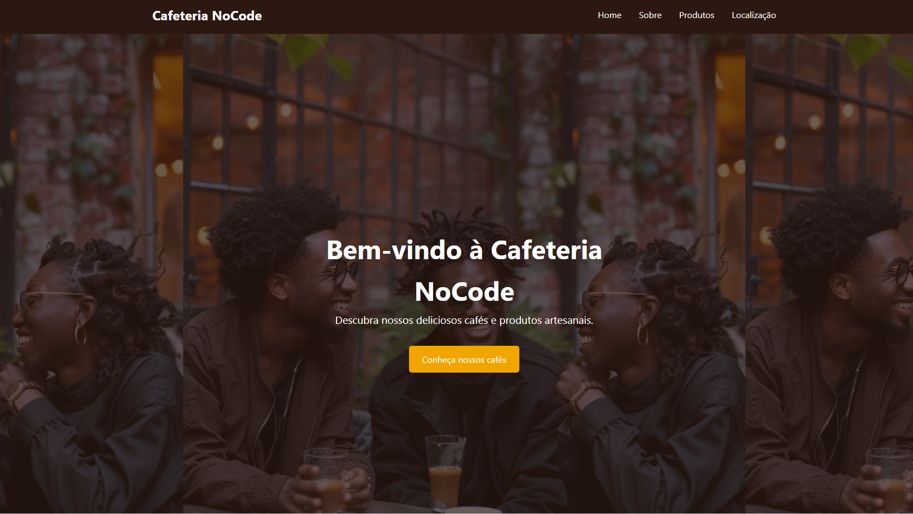

# ☕ Cafeteria NoCode

Projeto de landing page para uma cafeteria, desenvolvido durante o aprendizado com o vídeo do **Rodolfo Mori** do **Dev Club**.

## �️ Demonstração


> **Nota**: Para adicionar a imagem do projeto:
> 1. Tire uma screenshot da página aberta no navegador
> 2. Salve como `preview.png` na pasta raiz do projeto
> 3. A imagem será exibida automaticamente aqui

## �📋 Sobre o Projeto

A Cafeteria NoCode é uma landing page moderna e responsiva que apresenta os produtos e serviços de uma cafeteria fictícia. O projeto foi criado com foco em design clean e experiência do usuário, utilizando apenas HTML e CSS.

## ✨ Funcionalidades

- **Navbar Fixa**: Menu de navegação fixo no topo da página
- **Seção Hero**: Banner principal com imagem de fundo e call-to-action
- **Sobre Nós**: Apresentação da cafeteria e seus valores
- **Catálogo de Produtos**: Grid responsivo com cards dos produtos:
  - ☕ Espresso - R$ 8,00
  - 🥤 Cappuccino - R$ 13,00
  - 🧊 Café Gelado - R$ 20,00
- **Localização**: Mapa integrado do Google Maps e informações de contato
- **Chat de IA**: Widget de atendimento inteligente com GPT Maker AI integrado
- **Design Responsivo**: Adaptável a diferentes tamanhos de tela
- **Animações**: Efeitos hover nos cards e elementos interativos

## 🚀 Tecnologias Utilizadas

- **HTML5**: Estrutura semântica da página
- **CSS3**: Estilização e layout
  - Flexbox
  - Grid Layout
  - Transições e animações
  - Gradientes
  - Media Queries (responsividade)
- **GPT Maker AI**: Widget de chat inteligente para atendimento ao cliente

## 📁 Estrutura do Projeto

```
Cafeteria-NoCode/
│
├── index.html          # Página principal
├── style.css           # Estilos da aplicação
└── README.md           # Documentação do projeto
```


## 📚 Aprendizados

Este projeto foi desenvolvido acompanhando o tutorial do **Rodolfo Mori** no canal **Dev Club**, onde aprendi:

- Estruturação semântica de páginas web
- Técnicas modernas de CSS
- Criação de layouts responsivos
- Boas práticas de desenvolvimento front-end
- Implementação de mapas do Google Maps
- Integração de chat de IA para atendimento
- Design de interfaces atraentes

## 📱 Seções da Página

### Home
Banner principal com mensagem de boas-vindas e botão para explorar os produtos.

### Sobre
História da cafeteria e missão da empresa, fundada em 2020.

### Produtos
Apresentação visual dos principais produtos com preços.

### Localização
- **Endereço**: Rua farfar way, 123 - Centro, ninguém nunca chego lá - DN
- **Telefone**: (00) 4002-8922
- **E-mail**: contato@cafeterianocode.com
- Mapa interativo do Google Maps




